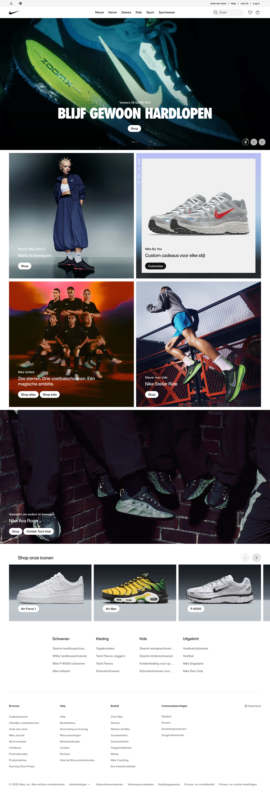
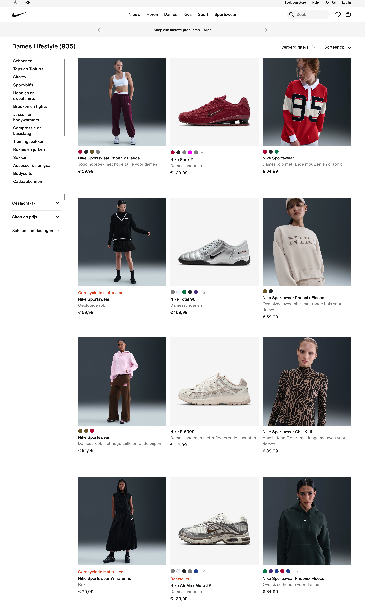
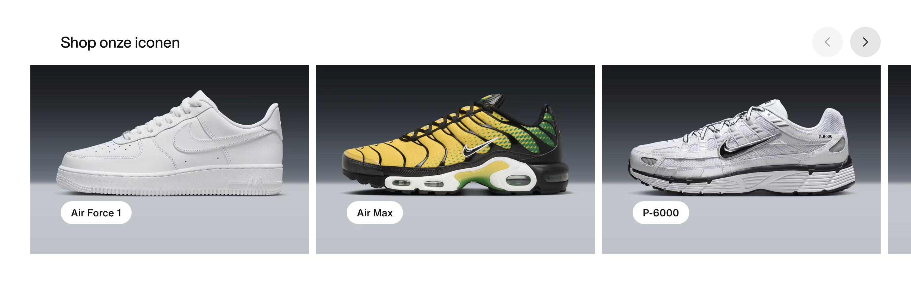
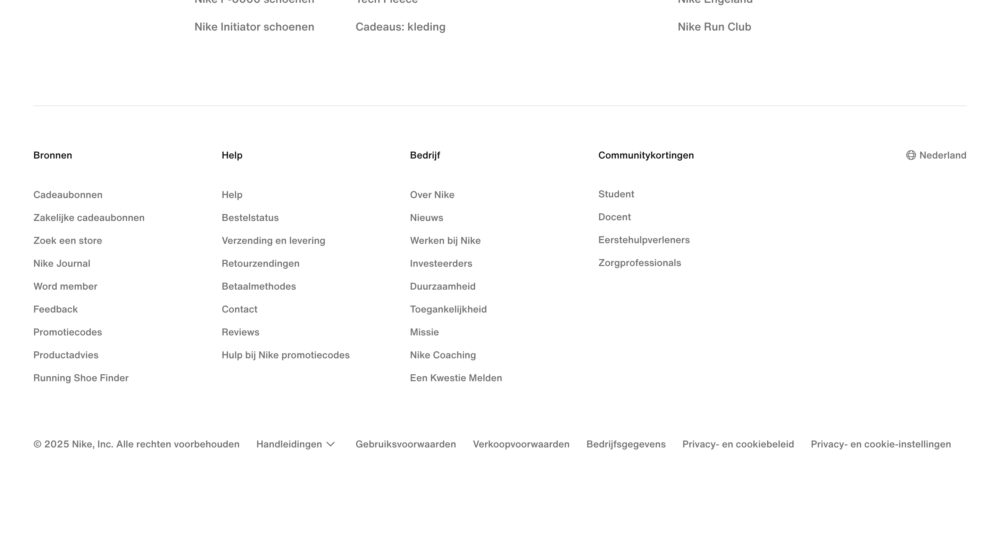
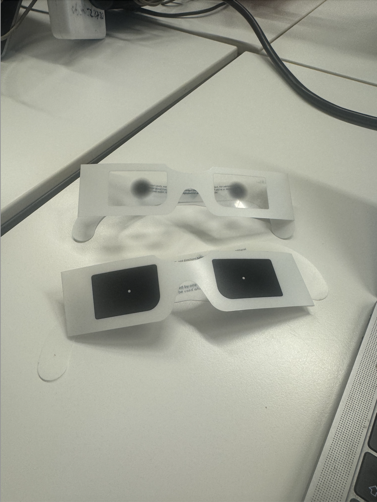
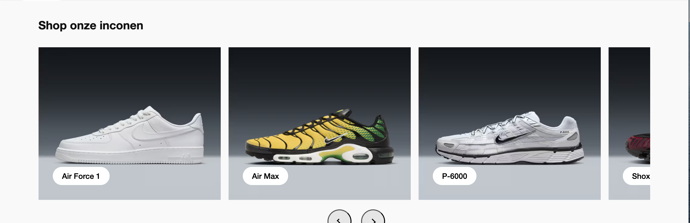

# Procesverslag
Markdown is een simpele manier om HTML te schrijven.  
Markdown cheat cheet: [Hulp bij het schrijven van Markdown](https://github.com/adam-p/markdown-here/wiki/Markdown-Cheatsheet).

Nb. De standaardstructuur en de spartaanse opmaak van de README.md zijn helemaal prima. Het gaat om de inhoud van je procesverslag. Besteedt de tijd voor pracht en praal aan je website.

Nb. Door *open* toe te voegen aan een *details* element kun je deze standaard open zetten. Fijn om dat steeds voor de relevante stuk(ken) te doen.

## Jij

  
uitwerken voor kick-off werkgroep

  ### Auteur:
  Rosalie Kroon

  #### Je startniveau:
  blauw

  #### Je focus:
  Surface lane (voor nu)
 

## Je website

  
uitwerken voor kick-off werkgroep

  ### Je opdracht:
  ## Website die ik ga namaken
  [Wesbite van Nike](https://www.nike.com/nl/)

  #### Screenshot(s) van de eerste pagina (small screen): 
  Voor pagina van Nike 
  

  #### Screenshot(s) van de tweede pagina (small screen):
  Sportwear, dames categorie 
  
 

## Toegankelijkheidstest 1/2 (week 1)

  
uitwerken na test in 2e werkgroep

  ### Bevindingen (toegangelijkheid test: brillen)
  Carrousel is lastig met beperkt zicht. Doordat je niet de pijl navigatie in het midden hebt, maar in de rechter hoek is het met bijvoorbeeld de bril lastig te zien dat je deze carrousel kan bewegen.

 Er is een witte achtergrond met grijze tekst, dit maakt het lastiger met een beperking. De kleuren contrast kan hiervoor beter. 

  

  Dit zijn de brillen die ik heb gebruikt tijdens de toegangelijkheids test.
  

 ### Bevindingen (toegangelijkheid test: Screenreader)

  Verschillende knoppen geven niet duidelijk aan wat ze doen, bijvoorbeeld de carrousel navigatie zegt alleen "knop" en niet wat het doet.

alt tekst is niet volledig

## Breakdownschets (week 1)

  
uitwerken na afloop 3e werkgroep

  

## Voortgang 1 (week 2)

  
uitwerken voor 1e voortgang

  ### Stand van zaken
  De carousel zag ik al op de website, dus wist ik dat ik die wilde gebruiken:

  

## Voortgang 2 (week 3)

  
uitwerken voor 2e voortgang

  ### Stand van zaken

  Over het algemeen is de voorpagina niet ingewkikkeld. Er zitten bepaalde soorten elementen in zoals een carousel. Dit is dan een uitdaging die ik had voor de voorpagina. 

  Ook ben ik begonnen met het werken met flexbox en grids. Dit ben ik ook gaan toepassen in mijn code voor de website. 
  ### Verslag van meeting

  Het ging over de breakdown schetsen en de stappen in het opzetten van je website, bijvoorbeeld, start eerst met al je html en daarna pas de css. 

  Ik was zelf al begonnen met de css omdat ik eigenlijk wilde kijken hoe het eruit kwam te zien, ook omdat ik sommige opdrachten had gemaakt (carousel, grid) wilde ik dit ook gelijk toepassen in mijn website.

  We keken ook nog even door mijn code wat ik tot nu toe had, ik had al mijn voorpagina met de meeste elementen. Dit was ook wel te doen omdat Nike een consistente structuur had. 

  Ook had ik nog een vraag over responsive maken van de navigatie, ze vertelde mij dat media queries hiervoor de beste optie is.

  Ook zat ik nog na te denken over waar ik mijn focus wil leggen. In de voorbereiding koos ik voor surface lane, maar ik heb mijn toch gekeerd naar responsive, voor mijn website vind ik dat toch de beste optie.

  Ik kan daarvoor dus gebruik maken van grids en media quaries.

## Toegankelijkheidstest 2/2 (week 4)

  
uitwerken na test in 9e werkgroep

  ### Bevindingen

 Tijdens de toegankelijkheidstest in tab-modus ging het vooral naar de knoppen maar vertelde het niet op welke knop je precies zit. Bijvoorbeeld bij 'Highlights' kan je naar deze pagina gaan op specifiek voor winterkleding te shoppen alleen gaf het aan "shop".

 Ook bij de footer gaf het de headers aan, maar niet de inhoud ervan.

 Als ik het in lees-modus zet dan geeft het wel alles aan. Het leest netjes de alts voor en ik heb de knoppen een aria-label gegeven, daardoor weet de screenreader ook bijvoorbeeld de knoppen onder de carousel te benoemen ("vorige" en "volgende").

 Ook leest het het 'hartje' voor als favorieten, het geeft ook aan of geklikt is of niet (aria-pressed=false). 

 Als ik in tab modus zit, gaat het verder wel goeed langs de navigatie, ook als ik het in responsive staat, het opent het hamburger menu en zo kan je verder door tabben in het zij paneel.

## Voortgang 3 (week 4)

  
uitwerken voor 3e voortgang

  ### Stand van zaken

   Hamburger menu button opdracht en/of hartje

  

  Allebei de elementen heb ik (soort van) in mijn website, alleen heeft het hamburger menu niet echt een soort transitie, er komt een zij paneel aan de rechterkant.

  Het favorieten van een product gebeurt als je op het product klikt en onderin kan je het dan mankeren als 'favorieten', het hartje wordt dan zwart en je krijgt een pop up dat het item is toegevoegd aan je favorieten. Dit wil ik veranderen door het hartje al op de image te zetten, zo kan ik een betere micro-interactie doen.

  States opdrachten: 
  - links, buttons  
  - :has()

  ### Agenda voor meeting 
  - Vragen over animatie
  - Kijken naar de overflow functie
  - check op logica van code

  

  ### Verslag van meeting (feedback Danny)
  Wat er nog gedaan moest worden:
  - Ik heb voornamelijk sections in mijn code omdat de nike website redelijk consistent is en niet veel
  verschillende elementen zijn, dus kon ik gebruik maken van sections.

  - Ook het gebruik van een unorderd list (<ul>) moest ik nog naar kijken, waarom gebruik ik dat bij sommige sections.

  - Het gebruik van sections heeft altijd een H2 tag nodig, dit had ik niet en moest ik ook aanpassen. De meeste hebben dat ook niet nodig maar ik zal dan de header van een section transparant maken via CSS. Dit is nodig om het toegankelijk te maken, de hierachie en de structuur is dan duidelijk. 

  - Zelf had ik nog een vraag over het gebruik van overflow en hoe ik dus 2 scroll functies op een website kan hebben. Ik had dit voor nu opgeslost door de 2 sections allebei te in de css te benoemen en een overflow-y: auto; erop te zetten, alleen gaf dit beide een een scroll functie maar niet samen. Dit ga ik oplossen door ze beide in een <aside> element te zetten, omdat het een side paneel is die los functioneert van de product grid. 

  - Ik had al deels wat grid elementen op de sections, maar nog niet allemaal dus hier ga ik nog verder na kijken, omdat ik nu ook responsive als focus heb.

  - We keken ook nog naar m'n CSS, omdat ik verschillende bronnen had gebruikt en nog niet klaar was heb ik voor het bepalen van size, padding, margin etc verschillende meeteenheden. Dit moet ik nog veranderen om het consistent te houden. 

  - Qua animatie, moet dit ook nog wat duidelijker. Ik heb een wishlist animatie gemaakt, alleen gebeurd er nog niet heel veel. Als het hartje bij een product geklikt wordt dan wordt deze rood en komt er een 1tje bij het winkelmandje, maar je ziet niet iets volledig op het scherm gebeuren. Dit moet nog duidelijker laten zien worden, misschien dat het hartje naar het winkelmandje gaat of dat het vergroot op het scherm zodat het echt te zien is dat je iets toegevoegd hebt.

  - Ook had ik mijn root nog niet helemaal goed. Dit is voor de standaarden qua kleuren en maten voor de website en dit had ik nog niet gedaan.

  - Als laatst ging het nog over de W3C Validation, deze zal ik nog uitvoeren op de hmtl en de css om te checken of het voldoet aan de standaarden.

## Eindgesprek (week 5)

  
uitwerken voor eindgesprek

  Geen eindgesprek.

  ### Je uitkomst - karakteristiek screenshots:

  - Tijdens het verder responsive maken van mijn website kwam ik erachter dat ik met <summery> en 
 niet gebruik kan maken omdat ik als de website op desktop formaat de inhoud van details "dicht" staan. als ik dus gebruik wil maken van een grid als het op dit formaat staat kon dat niet. Dus moet ik hier verandering in maken door een ul te gebruiken. Ik had eerst gebruik gemaakt van 
 maar dan blijft het open staan als het een accordion wordt met media queries. 
 

## Bronnenlijst

  
continu bijhouden terwijl je werkt

  Nb. Wees specifiek ('css-tricks' als bron is bijv. niet specifiek genoeg). 
  Nb. ChatGpT en andere AI horen er ook bij.
  Nb. Vermeld de bronnen ook in je code.

 bron code:
  1. bron: autoplay video toevoegen aan de voorpagina: https://www.youtube.com/watch?v=ng6_nnOFXbg 
  2. bron: gebruik van flexbox: https://developer.mozilla.org/en-US/docs/Learn_web_development/Core/CSS_layout/Flexbox
  3. bron: gebruik van object-fit voor tekst over video: https://developer.mozilla.org/en-US/docs/Web/CSS/Reference/Properties/object-fit
  4. bron: absolute en relative gebruik: https://stackoverflow.com/questions/42845674/problems-with-positionabsolute-and-video
  5. bron: bron voor grid-template-columns: https://www.youtube.com/watch?v=br-0i3U1VCA 
  6. bron: van tekst menu naar hamburger menu: https://codepen.io/zagaris/pen/qBmqQEN 
  7. bron: voor de coursel heb ik de oefening tijdens de les meegenomen in mijn code: https://codepen.io/shooft/pen/QwjQGZe

  8. bron: <aside> gebruik voor filter, dit was handiger voor een zij paneel om de filters samen te laten werken voor de scroll functie: https://developer.mozilla.org/en-US/docs/Web/HTML/Reference/Elements/aside + https://www.youtube.com/watch?v=2uKbSQ0mXGA 
  9. bron: ticky zij paneel filter https://codepen.io/abhisheko_o/pen/YzyMVgq 

  js
  10. bron: voor het maken van een clone voor de animatie. ik gebruikte CloneNode : https://developer.mozilla.org/en-US/docs/Web/API/Node/cloneNode
  11. bron: de positie en grootte bepalen van de animatie: https://developer.mozilla.org/en-US/docs/Web/API/Element/getBoundingClientRect
  12. bron: geeft aan hoelang de functie (animatie) duurt: https://developer.mozilla.org/en-US/docs/Web/API/Window/setTimeout
  13. bron: ik heb voor de animatie ook nog ChatGPT gebruikt, omdat ik het lastig vond om zonder classes dit te maken. ik heb voornamelijk gevraagd hoe de elementen hierboven samen werken voor de animatie en hoe ik dit in javascript kan toepassen:   
  
  clone.style.position = "fixed";
  clone.style.left = heartRect.left + "px";
  clone.style.top = heartRect.top + "px";
  clone.style.fontSize = "30px";
  clone.style.color = "red";
  clone.style.zIndex = "9999";
  clone.style.pointerEvents = "none";
  clone.style.transition = "all 0.6s ease";

  // force repaint
  clone.getBoundingClientRect();

  // stap 1: naar midden + groter
  clone.style.left = "50%";
  clone.style.top = "50%";
  clone.style.transform = "translate(-50%, -50%) scale(3)";

  Ik wist niet precies hoe je qua transities iets maakt en hoe je styled in Javascript, dit heb ik via ChatGTP opgezocht. 

 

